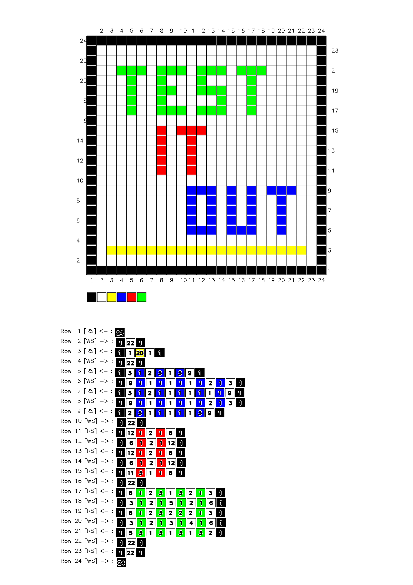

# ImageToTapestryPattern

A C++ program that converts small images into cross-stitch/tapestry pattern grids with row and column references, color palettes, and stitch sequence instructions.

## Description

This program takes a small image and transforms it into a large, readable tapestry or cross-stitch pattern. Each pixel in the original image is enlarged and separated by gridlines, making it easy to follow for needlework projects.

The output includes:
- **Enlarged pixel grid**: Each pixel becomes a square for easy counting
- **Row and column numbers**: On all four sides for easy navigation
- **Color palette**: Shows all colors used in the pattern
- **Stitch sequence**: Lists the color sequence for each row with counts, alternating between [RS] (right-to-left start) and [WS] (wrong-side/left-to-right start) directions, which is a standard convention in cross-stitch and tapestry work

## Building the Project

### Prerequisites
- CMake 3.10 or higher
- C++ compiler (supporting C++11 or later)
- OpenCV 4.x

### Build Instructions

```bash
# Create and enter build directory
mkdir -p build
cd build

# Configure with CMake
cmake ..

# Build the project
make
```

The compiled executable will be located at `build/app/Tapestry`.

## Usage

```bash
./build/app/Tapestry <input_image_path>
```

The program will create an output file with the same name as the input, appending `_tapestry.png`.

### Example

```bash
./build/app/Tapestry img/test_image.png
```

This generates `img/test_image_tapestry.png` as the output.

## Configuration

You can customize the output by modifying the following constants in [app/main.cpp](app/main.cpp#L3-L6):

- **MARGIN** (default: 100): White space border around the grid
- **LINE_MARGIN** (default: 1): Space around gridlines
- **LINE_THICKNESS** (default: 1): Width of grid separators in pixels
- **PIXEL_SIZE** (default: 25): Size of each pixel square in the output (in pixels)

Example output with default settings:

### Input Image


A small 24×24 pixel image with 5 colors.

### Output Pattern


The generated pattern shows:
- A 24×24 grid with each pixel enlarged to 25×25 pixels
- Black gridlines separating each square
- Row numbers on the left and right (1-24), with [RS] for odd rows (read right-to-left) and [WS] for even rows (read left-to-right)
- Column numbers on the top and bottom (1-24)
- A color legend at the bottom showing all colors used
- For each row, a sequence of color indices with run-length counts (e.g., `0 1 22 0` means: 1 pixel of color 0, then 22 pixels of color 1, then 1 pixel of color 0)

## Creating Input Images

To create the pixel art images that serve as input for this program, you can use **mtpaint**, a lightweight and versatile pixel art editor:

```bash
mtpaint &
```

mtpaint is perfect for creating small pixel art images because it:
- Has a simple, intuitive interface for pixel-level editing
- Supports multiple colors and palettes
- Allows you to zoom in for precise pixel work
- Can save in PNG and other common image formats
- Is lightweight and runs on virtually any system

Simply create or design a small image (e.g., 24×24 pixels) in mtpaint, save it as PNG, and pass it to the Tapestry program.

## Perfect For

- **Cross-stitch patterns**: Convert any small image into a cross-stitch guide
- **Tapestry weaving**: Generate patterns for tapestry looms with row direction indicators
- **Pixel art**: Create reference grids for pixel art projects
- **Embroidery**: Design embroidery patterns with color guidance

## How to Use the Pattern

1. Print or display the generated tapestry pattern
2. Follow the row numbers and color sequence for each row
3. Use the color palette legend to identify which thread or floss to use
4. The [RS] and [WS] indicators help you work the correct direction (standard in tapestry/cross-stitch)
5. Use the gridlines and numbering as reference for keeping your stitches aligned
